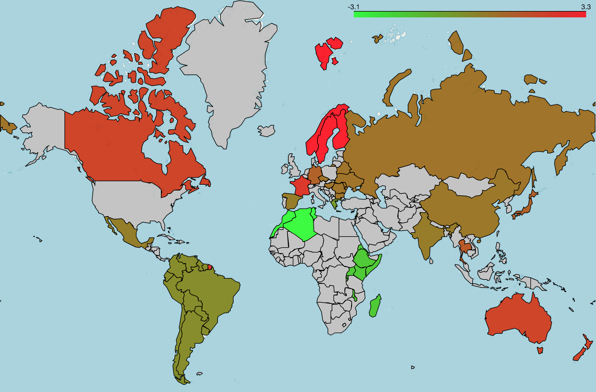
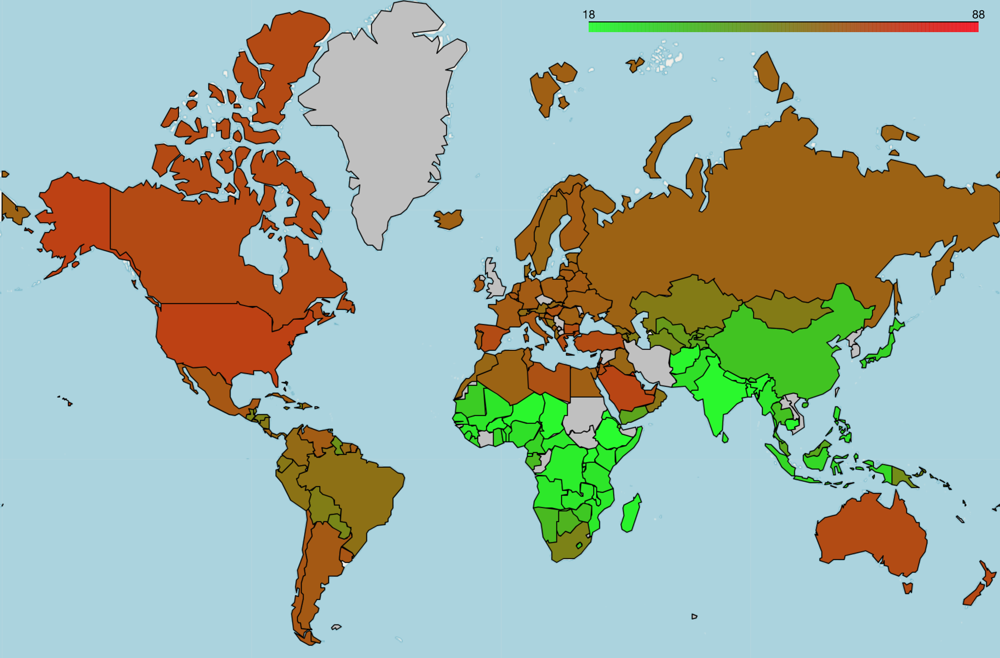
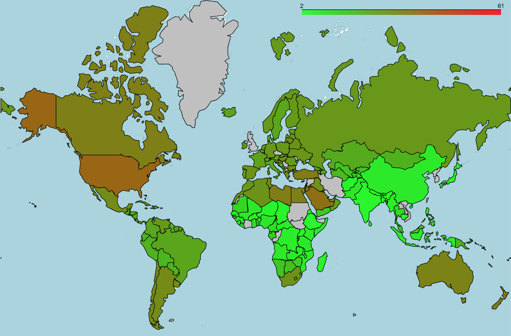
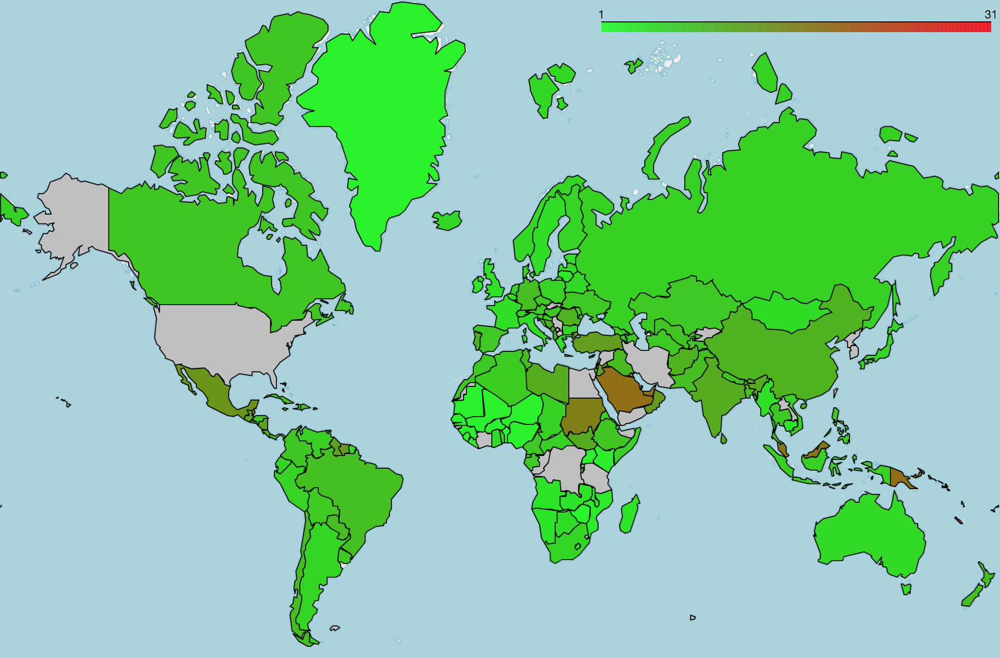

# Online Recipe Scraping

### Small school project: (Intro to datascience)

Repository containing information scraped on a cooking recipe website online. The idea was to get an understanding of culinary habits from around the world to be able to find further correlations down the road.

The first part of the collected data in 'scraping.ipynb' represents scraps from about 400 recipes from different regions around the world. Each recipe is associated with a region, and a title, a rating, an ingredient list and nutritional content information. This data is generated from web scraps and smart parses from the www.allrecipes.com website, and is exported in both csv and json formats. We made sure to keep common references between the CSV table datas and the more hierarchic and raw JSON files, so as to be able to access directly from the CSV to information one of the JSON file exclusively contains. The  CSV files are cleaned of all missing values and have a consistent and verified format in each given row. The numerical information the rows contain (quantities, scores,...) all are associated with a unit when possible, and are in either integer or float format and correspond to ONE serving of each recipe. The JSON exclusively contains information about the ingredients (stored as a dictionnary of dictionnaries). This information is also extensively cleaned, by different processes. Unit and quantity detection is first applied to the ingredient lists, as well as several corrections and transformations when needed (ounces to grams for example). Textual analysis is also used to detect fruits and vegetables from the ingredient lists, and link them to a quantity. This is done through the webscrapping of yet another website with lists of vegetables and exported as the 'veggies.csv' file. This is further explained in the notebook and is useful for calculations of the Nutriscore that is done in the final notebook. 

Average nutriscore of the scraped recipes per country

The second part of the data are tables from the World Health Organization (WHO) that represent food related diseases in each country and world region. Two diseases are studied: diabetes and overweightness (BMI > 25) / obesity (BMI > 30) on the adult population in 2017. 

Overweight

Obesity

Diabetes

Further analysis is done in the 'Final_notebook.ipynb' with the help of two other friends (they worked on the health WHO data and folium maps essentially).

In this notebook is calculated a 'Healthiness' score, using a metric approved by the french ministry of health, the NutriScore. This metric is computed by summing 'positive' nutrients and food attributes and substracting 'negative' ones using a well-defined formula and documentation. These attributes include sugar amounts, proteins, fibers, fats, all information that are generated from the web scraps. Additional needed information for computing the NutriScore is the amount of vegetables and fruits in the recipes, which is the reason for the detection functions included in the notebook. With that Nutriscore information and different learning based clustering and/or clustering techniques, we analyze and try to find patterns in region's culinar culture, and try to find correlations and patterns between alimentation and health. 
